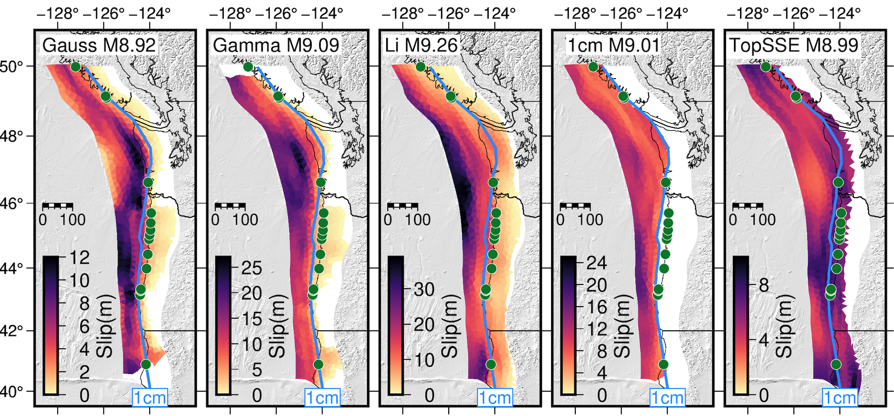

# Motivation

Welcome to the CRESCENT Cores2Code Python learning module!

This short book is your introduction to using Python to explore geophysical questions. If you're new to programming, that’s okay — we’ll build skills from the ground up, and everything will connect to what you’ve already experienced in the field and lab.

By the end of this book, you'll work with data and models from a real research study and use Python to investigate a key question: _Which kinds of earthquake rupture models best match the geologic evidence observed in the Pacific Northwest?_

---

## Why Python? Why Now?

Geophysics today is inseparable from computing. Whether you're analyzing GPS time series, modeling tsunamis, or mapping seismic shaking, you need to work with data — often large, complex, and multidimensional. Python is a modern scientific programming language that lets you do just that.

In this course, you'll learn to:
- Load and explore geophysical datasets
- Make maps and plots of earthquake effects
- Compare model results with field observations
- Communicate your findings with code and visuals

---

## From Field and Lab to Models

Over the past two weeks, you’ve:
- Visited coastal sites and collected stratigraphic and microfossil evidence of past earthquakes
- Analyzed those samples to identify signs of sudden subsidence or uplift
- Learned how these records inform our understanding of great earthquakes

Now we turn to modeling. How can we simulate possible future earthquakes on the Cascadia Subduction Zone and compare them to what the Earth tells us happened in the past?

That’s what this capstone exercise is all about.

---

## The Research Question

The figure below shows an example of several earthquake rupture models — all of simialr magntiudes (ish?) each simulating different assumptions about where and how slip occurs along the fault.

Each model predicts a different pattern of vertical land motion along the coast. Some models have slip that extends deep inland, while others do not. Some show slip reaching all the way to the trench, and others stop short offshore. The key question is: **which of these patterns are consistent with the geologic evidence?**

For example, paleoseismic studies of the 1700 Cascadia earthquake show that many coastal marshes subsided by as much as a meter. We’ll use Python to:
- Visualize these rupture models
- Plot the predicted subsidence and uplift
- Compare it to published field data

---

## What You’ll Do

At the end of the book, your capstone exercise will involve:
- Writing Python code to analyze vertical deformation from a set of rupture simulations
- Comparing these predictions to observed subsidence data
- Drawing conclusions about which models are consistent with the geologic record

---

## Why This Matters

These kinds of analyses aren’t just academic — they inform hazard maps, building codes, and emergency planning. But for models to be truly useful, we must always find ways to check their predictions against real data. This is at the heart of scientific progress.

As philosopher Karl Popper emphasized, the power of a scientific theory lies in its "testability" — the idea that a theory must make predictions that can be checked against observations. If a model or theory can't be tested, it isn't really a scientific theory at all. By comparing model outputs to geologic evidence, we’re not just learning Python — we’re practicing the essential art of science: confronting ideas with reality.

This module is a first step toward doing that kind of impactful, testable science. Let's dive in.
